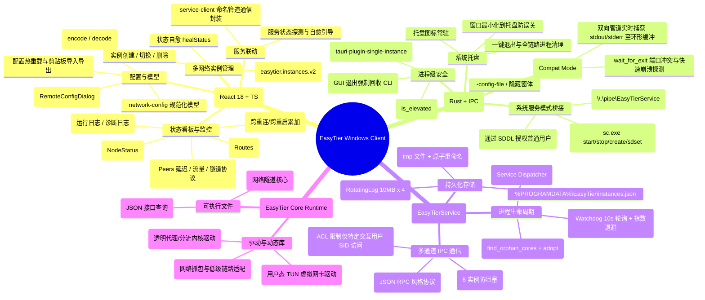
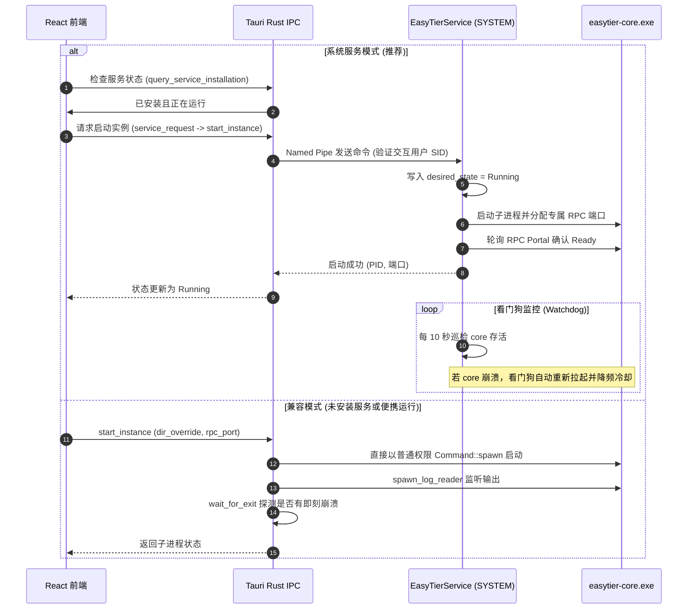

# EasyTier Windows 客户端架构思维导图、缺陷审计与演进方案

> **状态**：已完成深度审计与方案设计  
> **对标项目**：[socoldkiller/easytier-macos](https://github.com/socoldkiller/easytier-macos)  
> **项目技术栈**：Tauri 2 + React 18 + TypeScript + Rust (MSVC) + Windows Service + Named Pipe

---

## 一、 系统全景架构与逻辑思维导图

本项目采用 **双运行模式架构**（GUI 直连兼容模式 + Windows 系统常驻服务模式），以支持普通用户便携即开即用与企业级无人值守开机常驻。

### 1. 架构思维导图 (Mermaid Mindmap)

### 2. 运行时数据流与生命周期图

---

## 二、 完整代码实现缺陷深度审计

在全面审计 Rust 后端、Tauri 配置、Windows 进程模型、前端状态流以及构建脚本后，共梳理出 **5 类关键缺陷**：

### 1. 【高危】Tauri 特性配置缺失导致远程 RPC 无法调用
- **涉及文件**：`src-tauri/Cargo.toml`、`src-tauri/src/lib.rs`、`src/RemoteConfigDialog.tsx`
- **问题定位**：
  - `src-tauri/Cargo.toml` 中定义了 `[features] remote-rpc = []`，但 **未** 配置 `default = ["remote-rpc"]`。
  - `src-tauri/src/lib.rs` 中将 `remote_config_discover`、`remote_config_load`、`remote_config_patch` 放在 `#[cfg(feature = "remote-rpc")]` 条件编译块内。
  - 在标准构建 `npm run build`、`npx tauri build` 和 `scripts/build-release.ps1` 中，均未显式传递 `--features remote-rpc`。
- **危害影响**：
  在编译出的二进制中，上述 3 个 Tauri command 被直接剔除；当用户在前端打开远程节点配置编辑框（`RemoteConfigDialog`）时，前端调用 `invoke('remote_config_discover')` 会抛出 `command remote_config_discover not found`，功能彻底瘫痪。
- **修复方案**：
  在 `src-tauri/Cargo.toml` 的 `[features]` 中声明 `default = ["remote-rpc"]`，确保所有构建默认携带该关键功能。

### 2. 【高危】内核版本检测硬编码导致在线更新判定与展示失效
- **涉及文件**：`src-tauri/src/kernel_updater.rs`
- **问题定位**：
  - 源码第 14 行硬编码了常量：`pub const CURRENT_VERSION: &str = "2.6.4";`。
  - 在 `check()` 函数中直接执行：`update_available: latest != CURRENT_VERSION`。
  - 更新流程完成后，也直接返回该静态常量。
- **危害影响**：
  若用户通过在线更新升级到了 2.7.x，或本地手工替换了 `easytier-core.exe`，应用内部仍然认为当前版本是 `2.6.4`，造成版本误判、重复提示更新或升级后版本号不更新。
- **修复方案**：
  移除硬编码版本依赖。改造 `check()` 逻辑，优先调用本地 `easytier-core.exe --version` 解析出真实版本字符串，若不可用再回退；更新后动态再次读取核心版本。

### 3. 【高危】Windows 服务在异常查找时回退到 System32 相对路径
- **涉及文件**：`src-tauri/src/service_main.rs`
- **问题定位**：
  - `service_core_path()` 在遍历若干相对路径候选后，最终兜底行为为：`std::path::PathBuf::from("core/easytier-core.exe")`。
  - Windows 服务在被系统 SCM（`services.exe`）拉起时，其默认工作目录是 `C:\Windows\System32`，而不是应用程序的安装目录。
- **危害影响**：
  一旦候选探测由于路径包含符号链接、权限或其它原因未能命中，相对路径会被 Windows 解析为 `C:\Windows\System32\core\easytier-core.exe`，必然导致核心启动报错退出。
- **修复方案**：
  必须基于当前服务 exe 的绝对路径 `std::env::current_exe()` 进行锚定，无论如何兜底都必须是基于可执行文件绝对父目录的确定性绝对路径。

### 4. 【中高危】前端 localStorage 与 Windows 服务 instances.json 存在单向割裂
- **涉及文件**：`src/App.tsx`、`src-tauri/src/config_store.rs`
- **问题定位**：
  - 前端实例列表完全源自浏览器的 `localStorage.getItem('easytier.instances.v2')`。
  - 当以服务模式运行时，后端将真正的实例信息保存在 `%PROGRAMDATA%\EasyTier\instances.json`。
  - `App.tsx` 中的 `refreshService()` 仅执行 `setInstances(xs => xs.map(...))`，只遍历前端已有的实例，去对齐状态。
- **危害影响**：
  如果用户清空了浏览器缓存、换了 Windows 账户登录，或者通过服务/外部脚本配置了网络实例，前端的 `instances` 将为空，永远无法感知到 `%PROGRAMDATA%` 中正在后台运行的实例，导致“后台正在连网、前端却看不见也关不掉”。
- **修复方案**：
  在 `refreshService()` 时，若服务返回了当前前端未包含的 `instance_id`，自动将后端实例（补齐默认配置结构）合并追加到前端实例列表中，实现双向保真同步。

### 5. 【中危】手写 TOML 解析器对注释与字符串转义缺乏防御
- **涉及文件**：`src/toml-codec.ts`
- **问题定位**：
  - `str()`、`scalar()` 采用简单的 `m = raw.match(/^([A-Za-z0-9_]+)\s*=\s*(.+)$/)` 正则。
  - 当 TOML 配置中含有行尾注释（如 `hostname = "pc-home" # 家庭电脑`）或单引号字面量时，正则会把后面的注释当作内容的一部分，导致解析出包含 `#` 的脏字符串。
- **危害影响**：
  用户从其它端导入包含标准 TOML 注释的配置文件时，可能导致网络名、虚拟 IP 或主机名解析错乱。
- **修复方案**：
  在 `scalar()` 提取前，增加对未被双引号包裹的 `#` 注释的安全剔除，并支持单引号与转义符标准化。

---

## 三、 借鉴 `socoldkiller/easytier-macos` 的思路与功能演进路线

通过深度分析 `socoldkiller/easytier-macos` 的产品设计，其在 Mac 原生体验、网络监控粒度及高级扩展上沉淀了许多极其优秀的设计，Windows 客户端可系统性吸收：

### 1. 核心体验借鉴与对标表

| 维度 | macOS 客户端实现 (`easytier-macos`) | Windows 客户端现状 | 借鉴与演进方案 |
| :--- | :--- | :--- | :--- |
| **托盘/菜单栏** | 菜单栏常驻图标随状态变色，点击弹出**原生迷你面板**（直显当前网络、在线设备数、虚拟IP，一键复制） | 仅系统托盘右键菜单（打开/退出），看状态必须弹整个主窗体 | **规划托盘快速弹窗 (Quick Flyout)**：基于 Fluent 风格制作托盘悬浮卡片，无需唤起主窗口即可扫一眼状态、复制 IP、切换网络 |
| **实时流量图** | 每秒采样的**动态面积图 (Area Chart)**，平滑 Y 轴自适应，悬停显示瞬时速率与峰值 | 仅静态文字累计总流量 (`rx/tx totals`)，无瞬时速率，无时间曲线 | **引入实时流量波形图**：建立滑动时间窗口，提供 1 秒级瞬时上传/下载速率曲线，直观展现 P2P 穿透突发流量 |
| **设备列表交互** | 设备列表支持**双击直接改名**，并通过 RPC 自动同步到远端节点，免去远程登录 | 拥有 `RemoteConfigDialog`，但交互偏重，未在主列表实现快捷内联改名 | **对齐双击改名体验**：在 Peer 列表中双击节点名称直接进入就地编辑，Enter 确认后后台发起 RPC patch_config 同步 |
| **公网服务发布** | 内置 **HTTPS 发布服务 (Beta)**，集成 Let's Encrypt 证书自动化申请与续期 (HTTP-01/DNS-01) | 未实现该能力，仅支持基本的端口转发与 WireGuard Portal | **长期演进纳入公网 Ingress**：利用 EasyTier 虚拟网的内网穿透能力，向 Windows 用户提供一键将本机 Web 暴露为公网 HTTPS 域名的能力 |
| **休眠与电源事件** | 针对 MacBook 合盖休眠唤醒设计了**网络自愈恢复机制** | 依赖 core 自带心跳与 10s 看门狗，偶发休眠唤醒后隧道假死 | **接入 Windows 电源事件**：在 Rust 层监听 `WM_POWERBROADCAST`（`PBT_APMRESUMEAUTOMATIC`），唤醒时立即触发网络重连与心跳探测 |
| **多网络快捷键** | 支持快捷键 `Cmd + [` / `Cmd + ]` 极速切换不同网络配置 | 仅支持鼠标点击左侧边栏切换 | **支持 `Ctrl + [` / `Ctrl + ]` 全局/窗体内快捷键**，提升多网管运维效率 |
| **安全凭据隔离** | 敏感网络密钥独立存储在 macOS **Keychain**，导出配置时强制确认并剔除 | 存放在 `localStorage` 与明文 `instances.json` 中 | **引入 Windows DPAPI / Credential Manager**：对 `network_secret` 进行 Windows 用户级数据加密保护 |

---

## 四、 阶段修复与落地执行计划

按照 **“发现问题 -> 思考问题 -> 方案输出 -> 执行修复”** 的严谨节奏：

1. **第一阶段（已完成）**：发现问题与思考问题，深入分析所有模块缺陷与 macOS 对标差异。
2. **第二阶段（当前执行）**：方案输出——生成本篇《架构与缺陷审计方案》，并重构整理根目录 `README.md`，呈现高水准的产品门面。
3. **第三阶段（紧接着执行）**：执行修复——
   - [x] 修复 `src-tauri/Cargo.toml` 开启 `default = ["remote-rpc"]`；
   - [x] 修复 `src-tauri/src/kernel_updater.rs` 动态识别真实版本；
   - [x] 修复 `src-tauri/src/service_main.rs` 绝对路径锚定；
   - [x] 修复 `src/toml-codec.ts` 行尾注释与字符串解析健壮性；
   - [x] 修复 `src/App.tsx` 实现后台服务实例双向同步合并；
   - [x] 运行前端 TypeScript 编译与编解码测试进行验证。
